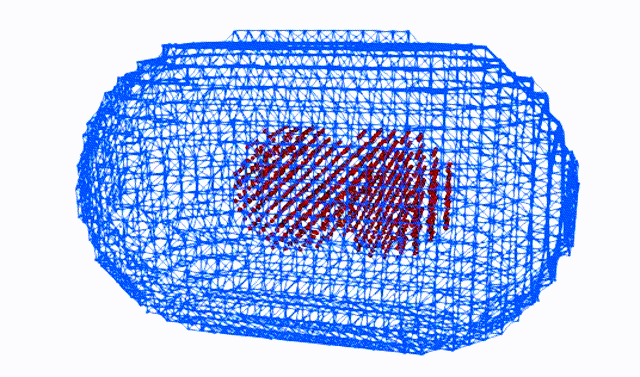

# CeMPS: MPS program for C. elegans hydrodynamic simulation

This is the code for [An interplay between cytoplasmic flow and cell morphology during cytokinesis simulated by the moving-particle semi-implicit method](https://doi.org/10.64898/2025.12.22.695877). This project is carried out in cooperation with Funahashi Lab. at Keio University and Kimura Lab. at the National Institute of Genetics.

## Usage

1. Clone this repository
2. Set simulation condition by editing some defined values in `Ce_MPS.h`
    - Particle Distance (Resolution): `#define DISTANCE_OF_PARTICLES xxxE-6`
    - Other parameters such as length of cell major axis `L_AXIS` and minor axis `S_AXIS`, simulation time `SIMULATION_TIME`, size, time, or dt, etc.
3. `make`
    - Confirm in advance whether your gcc supports OpenMP (It might be runnable with a warning in single thread mode)
4. run by `./simCeMPS [options] mesh_file`
    - Options:
      - `-s ***shape***`: specify shape (normal, triangle, square, circle, vshape, lshape). Default: normal
      - `-y`: asymmetry division mode
      - mesh file will be generated by PCL (as explained below)
5. Check result data in `result` dir
    - `data`: When you turn `ON` the `OUTPUT_CSV` in `Ce_MPS.h`, time courses of (x,y,z,vx,vy,vz) for each particle are output in this directory as a .csv file
    - `wall`: When you turn `ON` the `OUTPUT_CSV` in `Ce_MPS.h`, time courses of the wall particle data are output as a .csv file
    - `membrane`: When you turn `ON` the `Ce_MPS.h` in `OUTPUT_MEM_CSV`, time courses of the membrane particle data are output as .csv and .vtk file
    - `particle_xxxx.vtu`: Whole results suitable for the visualization software ParaView
    - `point.dat`: Required for making membrane mesh using PCL

6. Other
    - Cell shape is defined in `initialize_Position_and_Velocity.c` and you can define any shape by editing this file
    - Further information for the moving-particle semi-implicit method: Koshizuka S, Shibata K, Kondo M, Matsunaga T. Moving particle semi-implicit method: a meshfree particle method for fluid dynamics. London, United Kingdom: Academic Press, an imprint of Elsevier; 2018.

## Membrane mesh generation using PCL

1. Install PCL
    - For details and dependencies, check [the official site](https://pointclouds.org/)
    - The code is basically developed on version 1.8.1 of PCL
2. Run the program without specifying the mesh file
    - The simulation will stop (with a warning `file not found`) while creating `point.dat` in `result`
3. Change the parameters defined by `#define` in the file `makeMesh.cpp` in the `PCL` directory
    - `PARTICLE_DISTANCE`: match with `Ce_MPS.h`
    - `WIDTH`・`HEIGHT`: match `WIDTH`×`HEIGHT` with the line number of `point.dat`, and match the aspect ratio
4. Move to the `PCL` directory and run `mkdir build`, then `cd build` and `cmake ..`. A `Makefile` will be generated in the `build` directory. Then `make` to generate `makeMesh`
    - `cmake` is required (install if not installed)
5. Copy `point.dat` from `result` to `PCL/build` then run `./makeMesh`
    - `p_mesh.vtk` will be generated in `build` directory. Use this file for the mesh file

## Authors

- Yusuke Yoshimi
- Yuki Tsukada
- Akira Funahashi

## Acknowlegement

These programs are written by referring the Japanese book "Ryushihou Nyumon" (a primer for particle simulation) by Seiichi Koshizuka, Kazuya Shibata, and Kohei Murotani, Maruzen 2014.
This work was supported by JSPS KAKENHI Grant Number JP15KT0083.

***

## 使い方

1. このRepositoryを`git clone`する
2. `Ce_MPS.h`内の`#define`の値を変更し、シミュレーション条件を与える

- 初期粒子間距離(解像度): `#define DISTANCE_OF_PARTICLES xxxE-6`
- その他のパラメータ (細胞の長径`L_AXIS`、短径`S_AXIS`、シミュレーション時間`SIMULATION_TIME`など)

1. `make`する

- 事前に自分のgccがOpenMPをサポートしているかを確認する (していなければWarningが多数出るが、恐らくそのままシングルスレッドで実行可能)

1. `./simCeMPS [options] mesh_file` で実行

- オプションは以下の通り
  - `-s ***shape***`: 形状を指定する (normal, triangle, square, circle, vshape, lshape)。デフォルト(未指定時)はnormal。
  - `-y`: 非対称分裂モード
  - mesh fileはPCLを使って生成する (以下に説明あり)

1. `result`ディレクトリに結果が出力される
   - `data`: `Ce_MPS.h`で`OUTPUT_CSV`を`ON`にした場合、各粒子ごとの時系列データ(x,y,z,vx,vy,vz)が出力される
   - `wall`: `Ce_MPS.h`で`OUTPUT_CSV`を`ON`にした場合、各膜粒子の時系列データ(.csv)が出力される
   - `membrane`: `Ce_MPS.h`で`OUTPUT_MEM_CSV`を`ON`にした場合、各時刻における膜粒子のデータ(.csvと.vtk)が出力される
   - `particle_xxxx.vtu`: 結果のデータファイル。「ParaView」にて可視化可能
   - `point.dat`: PCLでの膜メッシュ生成に必要
2. その他
   - 細胞形状は`initialize_Position_and_Velocity.c`内で自力で定義します

## PCLを用いた膜メッシュ生成

1. PCLをインストールする
   - 詳しい説明やDependenciesなどは[公式サイト](https://pointclouds.org/)を確認
   - 僕が使ってたPCLのバージョンは1.8.1
2. 一度粒子法のプログラムを無理やり回す (mesh fileは未指定)
   - シミュレーションは止まる(一致する粒子がないと怒られる)が、`result`内に`point.dat`が生成される
3. `PCL`ディレクトリ内の`makeMesh.cpp`内の`#define`の値をモデルに合わせて変更
   - `PARTICLE_DISTANCE`: `Ce_MPS.h`に合わせる
   - `WIDTH`・`HEIGHT`: `WIDTH`×`HEIGHT`が`point.dat`の行数になるように、かつ(多分必要ないけど)アスペクト比がだいたい合うように揃える
4. `PCL`ディレクトリに移動し、`mkdir build`して`cd build`して`cmake ..`すると`build`ディレクトリ内に`Makefile`が生成されるので、`make`すると`makeMesh`が生成される
   - `cmake`とかが入ってなければ入れてください
5. `result`にある`point.dat`を`PCL/build`にコピーして、`./makeMesh`する
   - `build`ディレクトリ内に`p_mesh.vtk`が生成されるので、これをmesh fileとして利用する

## 謝辞

このプログラムは「粒子法入門」越塚誠一、柴田和也、室谷浩平　著　丸善出版　記載のサンプルプログラムを参考に書き下ろしたものです。粒子法一般の詳細については書籍を参考にしてください。
